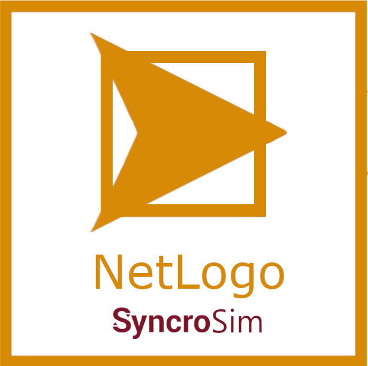

# **NetLogo** SyncroSim Package

    <a href="https://github.com/ApexRMS/netlogo">
 
## Simulation and model building with NetLogo and SyncroSim
### *netlogo* is a [SyncroSim](https://syncrosim.com/) Base Package providing a scenario-based interface for running the NetLogo agent-based modelling environment.

The [SyncroSim](https://syncrosim.com/) **netlogo** package is designed to provide an interface for the [NetLogo model](https://ccl.northwestern.edu/netlogo/). NetLogo is a multi-agent programmable environment for agent-based simulation modelling. The **netlogo** package for SyncroSim allows users to structure scenario input and output data, run the model and explore model outputs using either a graphical user interface (GUI), a command line interface or the [rsyncrosim](https://syncrosim.com/r-package/) package for [R](https://www.r-project.org/). The initial version of the **netlogo** package was written against NetLogo version 6.1.1.

## Requirements

This package requires the [latest SyncroSim release](https://syncrosim.com/download/).
 
 
## How to Install

1. [Download](https://ccl.northwestern.edu/netlogo/download.shtml) and install NetLogo (Note: a Java runtime environment is required to run NetLogo).
2. [Install SyncroSim](http://docs.syncrosim.com/getting_started/inst_win.html).
3. Open SyncroSim and select **File -> Packages… -> Install…**, then select the **netlogo** package and click **OK**.

 
## Getting Started

For more information on the **netlogo** SyncroSim package, including a Quickstart Tutorial, see the [Getting Started](https://apexrms.github.io/netlogo/getting_started.html) page.
 
 
## Links

Browse source code at
[http://github.com/ApexRMS/netlogo/](http://github.com/ApexRMS/netlogo/)
 
Report a bug at
[http://github.com/ApexRMS/netlogo/issues](http://github.com/ApexRMS/netlogo/issues)
 
 
## Developers

Leonardo Frid (Author, maintainer) 
 
Alex Embrey (Author)
 
Shreeram Senthivasan (Author)
